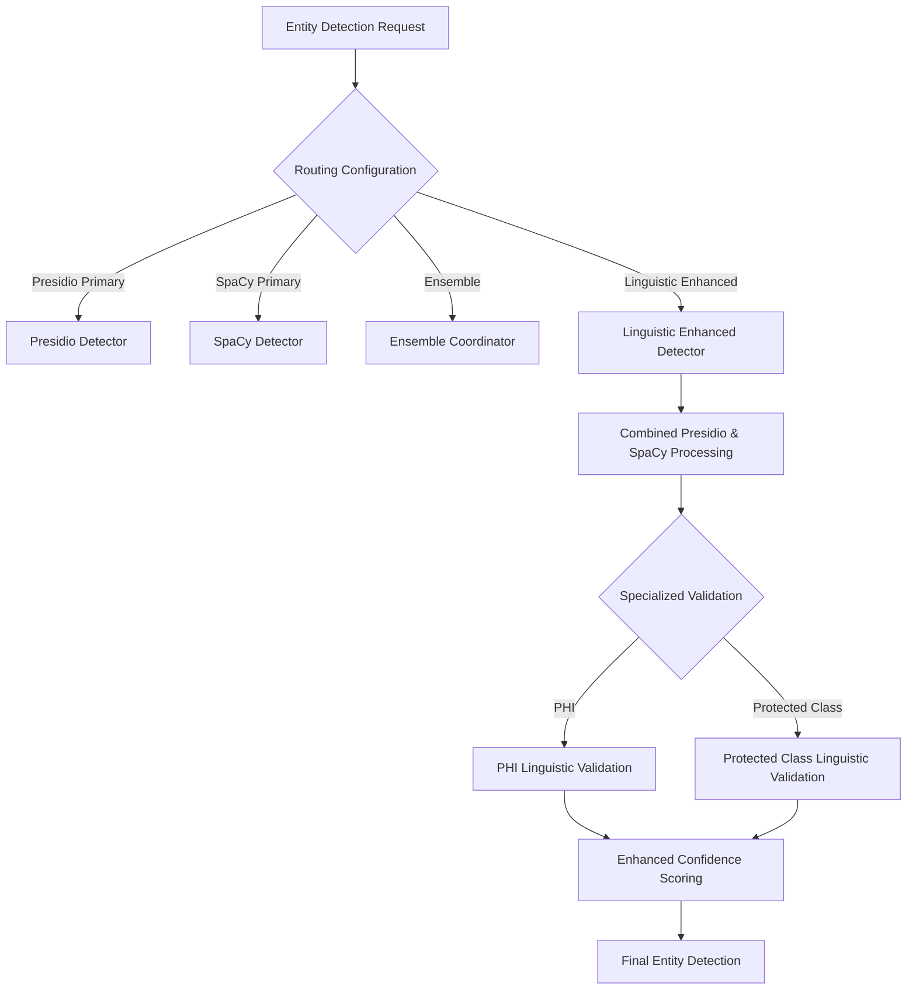

# Enhanced Entity Detection Architecture

**NOTE**: This is more of a thought piece. 
1. The original project was intended to explore being forced to develop without LLMs.
2. Any ability to use an LLM would be a much-welcome addition.
3. The difficulties in designing with non-llm hits diminishing returns and more complexity. 

## Current Architecture
- Independent detection engines (Presidio, SpaCy)
- Ensemble coordination
- Rule-based validation
- Configuration-driven matching

## Proposed Enhanced Architecture

### Key Challenges
1. Limited context understanding
2. Rigid validation rules
3. Insufficient handling of nuanced entities (PHI, Protected Class)

### Proposed Solution: Linguistic-Enhanced Detection Strategy

#### Core Principles
- Preserve existing detector strengths
- Add linguistic context intelligence
- Minimal architectural disruption
- Configuration-driven flexibility

### Detection Strategy Evolution



### Validation Enhancement Approach
1. Configuration-driven context recognition
2. Scoring-based validation
3. Minimal spaCy integration
4. Fallback to existing methods

### Configuration Example
```yaml
detection_strategies:
  PHI:
    method: linguistic_enhanced
    enabled: true
  PROTECTED_CLASS:
    method: linguistic_enhanced
    enabled: true
```

### Implementation Phases
1. Configuration Extension
2. Validation Method Enhancements
3. Minimal spaCy Integration
4. Comprehensive Testing

### Key Benefits
- Incremental improvement
- Maintaining existing architecture
- Flexible, configurable approach
- Minimal refactoring

### Potential Challenges
- Performance overhead
- Complexity management
- Consistent validation across detectors

## Next Steps
1. Prototype validation methods
2. Create comprehensive test cases
3. Iterative refinement
4. Performance benchmarking

## Architectural Principles
- Modularity
- Configuration Flexibility
- Minimal Disruption
- Intelligent Context Understanding

# Schedule
This isn't a small refactoring - it's a significant architectural change that would touch multiple components:

1. Entity Routing
2. Detector Base Classes
3. Individual Detectors (Presidio, SpaCy)
4. Ensemble Coordinator
5. Configuration Management
6. Validation Rules
7. Test Suites

Estimated work:
- Design & Architecture: 2-3 days
- Implementation: 5-7 days
- Refactoring Existing Code: 3-4 days
- Testing & Validation: 4-5 days

Total: ~2-3 weeks of focused work, potentially more depending on complexity and unforeseen challenges.

The alternative is to:
1. Enhance existing validation methods
2. Improve configuration-driven validation
3. Create more flexible context recognition
4. Minimize structural changes
5. Pick a new strategy that uses LLMs if possible

