# Resume Redaction System Architecture

## Overview
The Resume Redaction System automatically detects and redacts sensitive information from resumes and professional documents while preserving important technical and professional content. The system leverages a sophisticated, configuration-driven approach to entity detection and validation, combining advanced natural language processing techniques with flexible validation rules and comprehensive analysis capabilities.

## System Design Principles
- **Modular Architecture**: Easily extensible detection, validation, and analysis components
- **Configuration-Driven**: Validation and detection rules defined through JSON and YAML configurations
- **Multi-Model Approach**: Combines multiple NLP models for comprehensive entity detection
- **Contextual Intelligence**: Advanced context-aware validation of detected entities
- **Configurable Confidence Scoring**: Flexible threshold and confidence management
- **Privacy-Preserving**: Robust redaction of sensitive personal information
- **Analysis-Ready**: Built-in tools for detection analysis and system improvement

## Directory Structure
```
resume_redaction/
├── app/
│   ├── config/
│   │   └── config.yaml
│   └── utils/
│       ├── config_loader.py
│       └── logger.py
├── redactor/
│   ├── config/
│   │   ├── entity_routing.yaml
│   │   ├── validation_params.json
│   │   ├── validation_config.json
│   │   └── word_filters.yaml
│   ├── detectors/
│   │   ├── base_detector.py
│   │   ├── ensemble_coordinator.py
│   │   ├── presidio_detector.py
│   │   └── spacy_detector.py
│   └── validation/
│       └── entity_validation.py
├── evaluation/
│   ├── analysis/
│   │   └── detection_analyzer.py
│   ├── metrics/
│   │   └── entity_metrics.py
│   ├── comparison/
│   │   └── entity_matcher.py
│   ├── models.py
│   ├── evaluate.py
│   └── test_runner.py
├── data/
│   └── test_suite/
│       ├── originals/
│       ├── annotations/
│       └── results/
└── tests/
    └── unit/
```

## System Architecture Diagrams

### High-Level System Overview
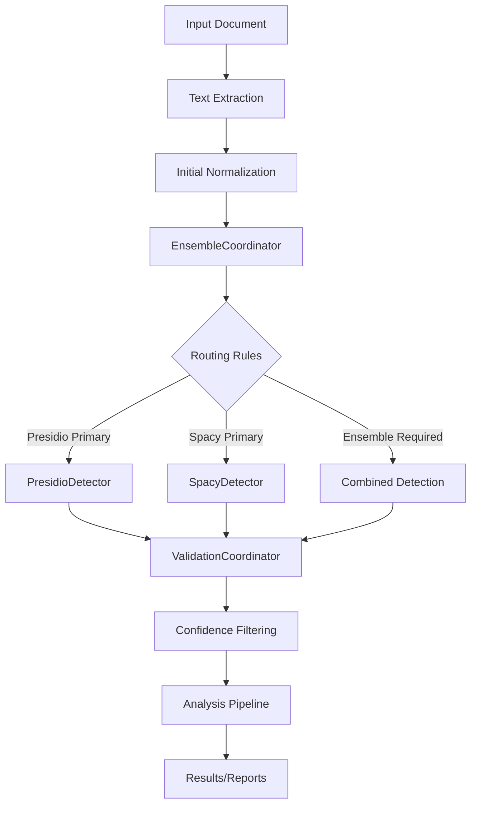

### Detection and Analysis Flow
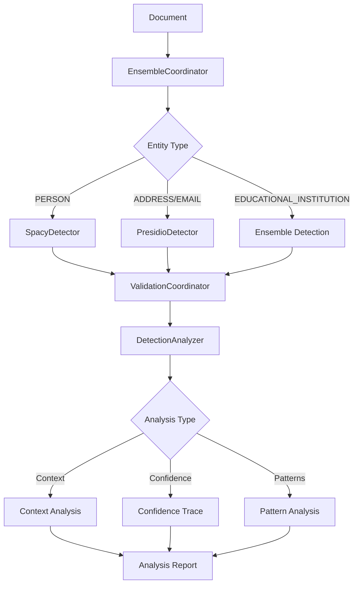

### Validation and Analysis Components
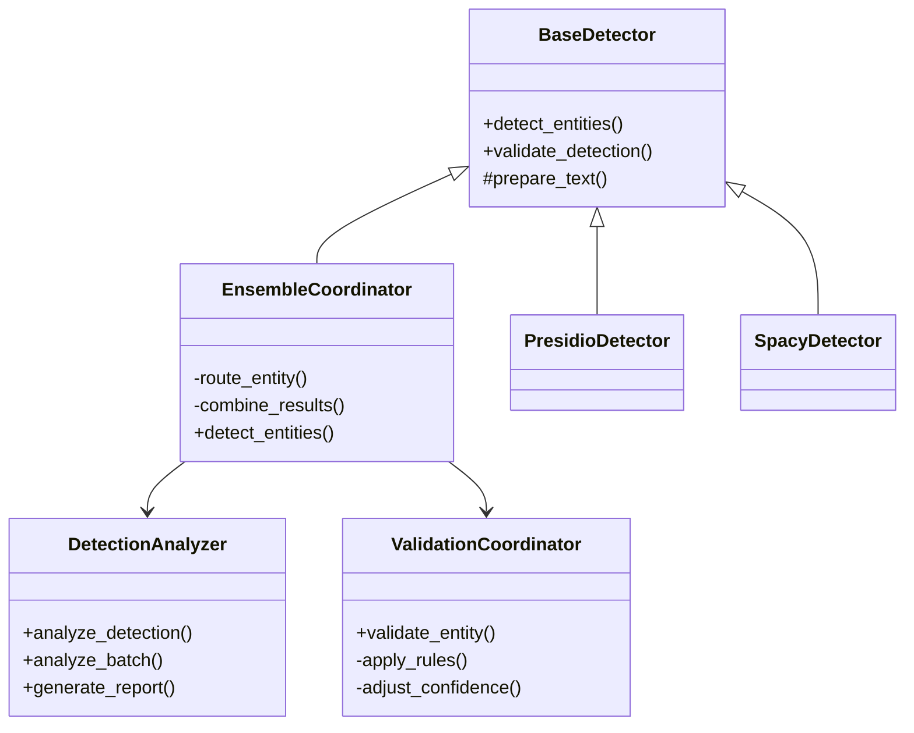

## Core Detection Framework

### 1. Core Detection Interfaces

#### BaseDetector
Abstract base class defining core detection capabilities:
- Shared configuration and logging mechanisms
- Basic text preparation utilities
- Foundational entity detection interface
- Debug and logging support
- Confidence threshold management

#### Specialized Detectors
1. **PresidioDetector**
   - Pattern-based entity recognition
   - Strong performance with structured data
   - Specialized in detecting formatted identifiers
   - Handles addresses, emails, and structured personal information

2. **SpacyDetector**
   - Context-aware named entity recognition
   - Advanced linguistic analysis
   - Strong performance with unstructured text
   - Specializes in person names, organizations, and contextual entities

#### EnsembleCoordinator
Central orchestration component for entity detection:
- Manages multiple detection systems
- Routes entities based on configuration
- Combines results using weighted confidence scores
- Resolves conflicts between different detectors
- Applies post-processing to remove overlapping entities

### 2. Analysis Framework

#### DetectionAnalyzer
New component for comprehensive detection analysis:
- Detailed analysis of detection decisions
- Validation rule effectiveness tracking
- Context pattern analysis
- Confidence adjustment tracing
- Batch analysis capabilities
- Multiple report formats (text/JSON)

Key Analysis Areas:
1. **Detection Analysis**
   - Raw detector signals
   - Initial confidence scores
   - Detection source decisions
   - Pattern matching results

2. **Validation Analysis**
   - Rule application tracking
   - Confidence adjustment traces
   - Validation effectiveness metrics
   - Rule impact analysis

3. **Context Analysis**
   - Surrounding text analysis
   - Pattern recognition
   - False positive indicators
   - Contextual feature extraction

4. **Batch Analysis**
   - Aggregate statistics
   - Pattern identification
   - System-wide metrics
   - Trend analysis

### 2. Configuration Management System

#### Configuration Files

##### validation_params.json
The central configuration for entity validation:
- Defines comprehensive validation rules per entity type
- Specifies confidence adjustment mechanisms
- Provides detailed context requirements
- Includes pattern definitions for complex validations
- Supports fine-grained validation logic for sensitive entities

Key Configuration Sections:
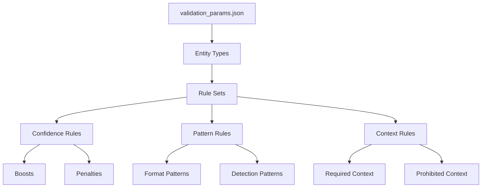

##### entity_routing.yaml
Defines detection and routing strategies:
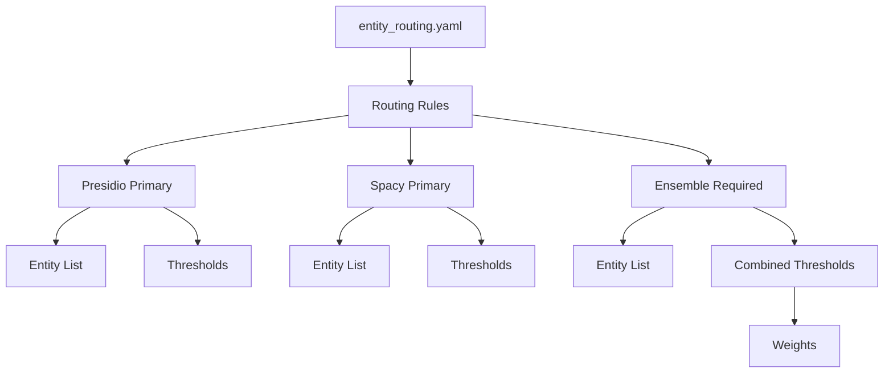

Example Configuration:
```yaml
routing:
  presidio_primary:
    entities:
      - ADDRESS
      - EMAIL_ADDRESS
      - PHONE_NUMBER
    thresholds:
      ADDRESS: 0.8
      EMAIL_ADDRESS: 0.7
      PHONE_NUMBER: 0.8

  spacy_primary:
    entities:
      - PERSON
    thresholds:
      PERSON: 0.6

  ensemble_required:
    entities:
      - EDUCATIONAL_INSTITUTION
      - PHI
      - PROTECTED_CLASS
    confidence_thresholds:
      EDUCATIONAL_INSTITUTION:
        minimum_combined: 0.75
        presidio_weight: 0.5
        spacy_weight: 0.5
```

#### ConfigLoader
Centralized configuration management:
- Dynamic configuration loading
- Environment-specific settings
- Validation of configuration files
- Error handling and logging
- Path resolution for configuration resources

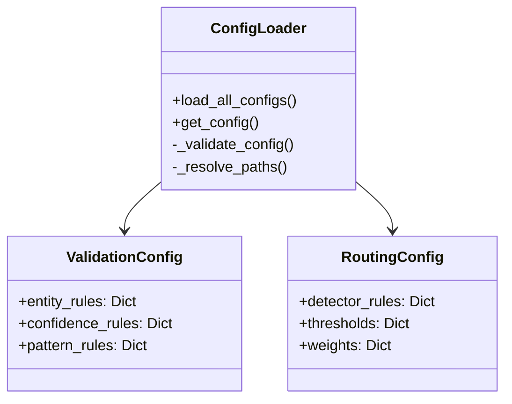

### 3. Validation Framework

#### ValidationCoordinator
Core validation orchestration component:
- Centralizes validation logic for all entity types
- Implements configuration-driven validation strategies
- Provides unified validation interface
- Manages complex validation workflows
- Supports multi-stage validation processes

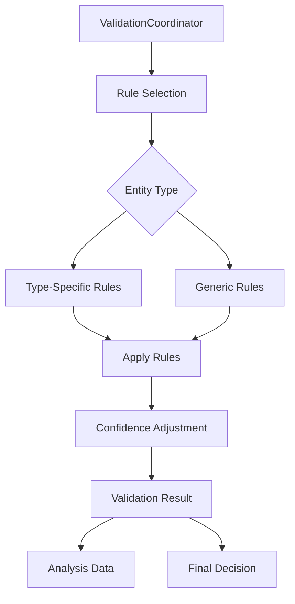

#### Validation Methods
The system uses a comprehensive, modular approach to entity validation:
- Dedicated validation methods for each entity type
- Configuration-driven validation rules
- Flexible confidence adjustment mechanisms
- Detailed reasoning and context analysis

Validation Process:
1. Receive detected entities from detectors
2. Identify the appropriate validation method
3. Apply type-specific validation rules
4. Analyze contextual information
5. Dynamically adjust confidence scores
6. Determine entity validity
7. Provide detailed validation results with reasoning

#### Entity Validation Methods
Specialized validation methods for various entity types:
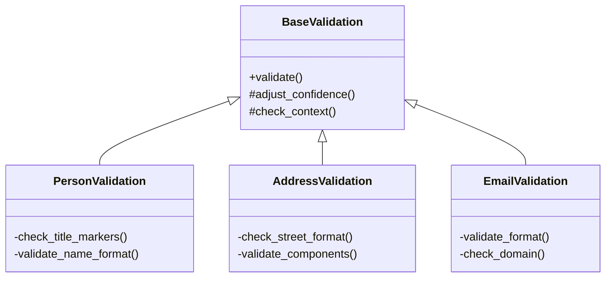

#### Validation Strategies
- **Rule-Based Validation**: Configuration-defined rules
- **Contextual Analysis**: Deep linguistic and contextual examination
- **Confidence Scoring**: Dynamic confidence adjustment
- **Multi-Model Validation**: Cross-validation across detection systems

#### Integration with Analysis Framework
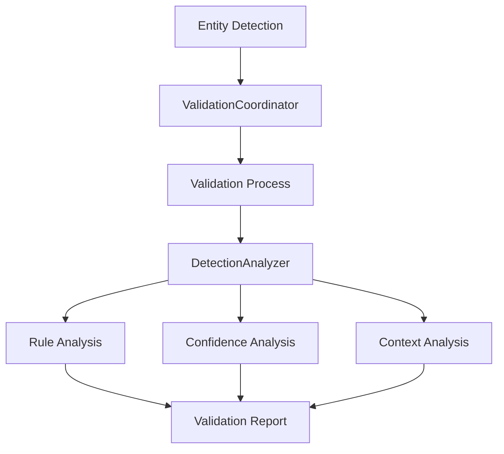

### 4. Processing Pipeline

#### Entity Detection Workflow
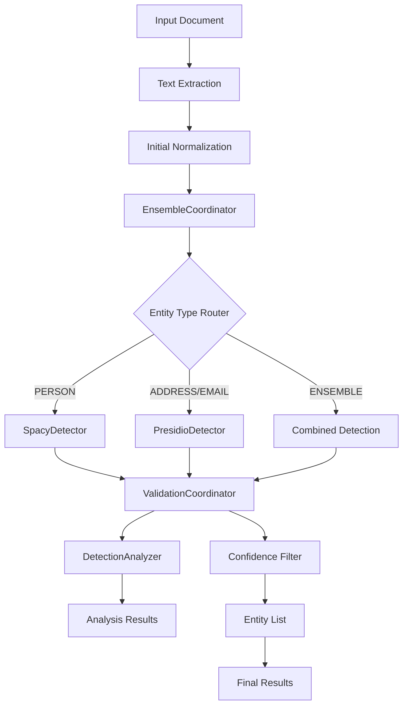

#### Processing Stages

##### 1. Input Processing
- Document text extraction
- Initial text normalization
- Prepare for entity detection

##### 2. Entity Detection
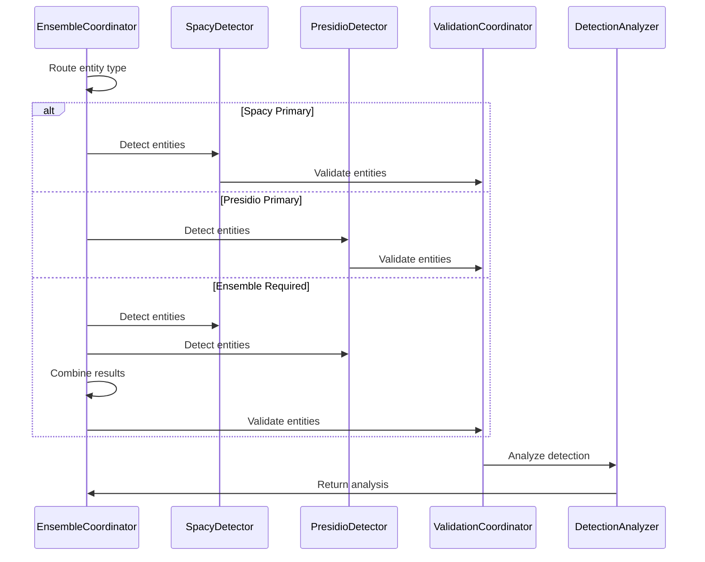

##### 3. Validation Process
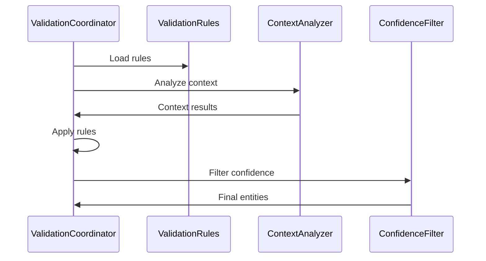

### 5. Evaluation and Analysis Framework

#### Evaluation Components

##### Performance Metrics Tracking
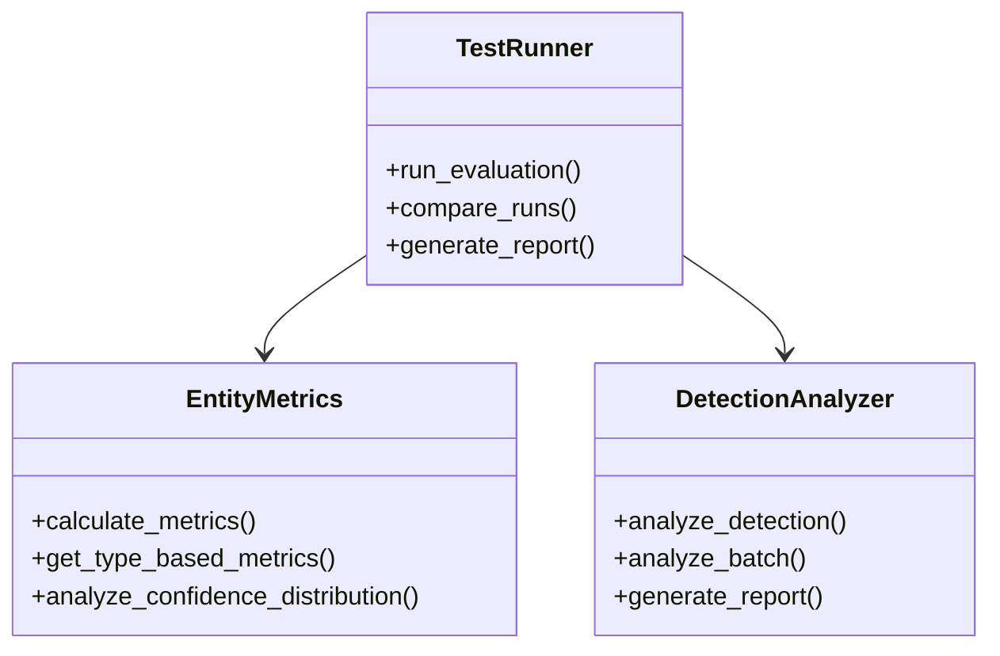

Key metrics for system assessment:
- Entity detection accuracy by type
- Validation rule effectiveness
- Detector performance comparison
- Context validation success rate
- Processing performance metrics
- Configuration coverage analysis
- False positive/negative analysis

##### TestRunner
Comprehensive testing infrastructure:
- Batch test execution
- Statistical analysis
- Performance metrics collection
- Comparative testing between versions
- Validation rule effectiveness assessment

#### Test Suite Organization
```
data/
  test_suite/
    originals/       # Original test documents
    annotations/     # Ground truth annotations
    results/        # Test run results
      run_20240214_120000/
        alexis_rivera_results.json
        summary.json
    test_manifest.yaml  # Test definitions
```

#### Evaluation Strategies

##### EntityMatcher
Advanced entity validation system:
- Ground truth comparison
- Precise entity span matching
- Confidence threshold testing
- False positive/negative analysis
- Contextual validation verification

##### Analysis Components
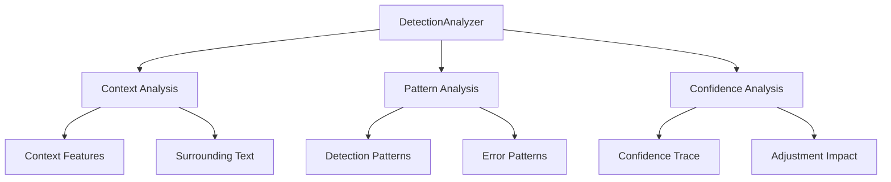

### 6. Integration Points

#### Component Integration
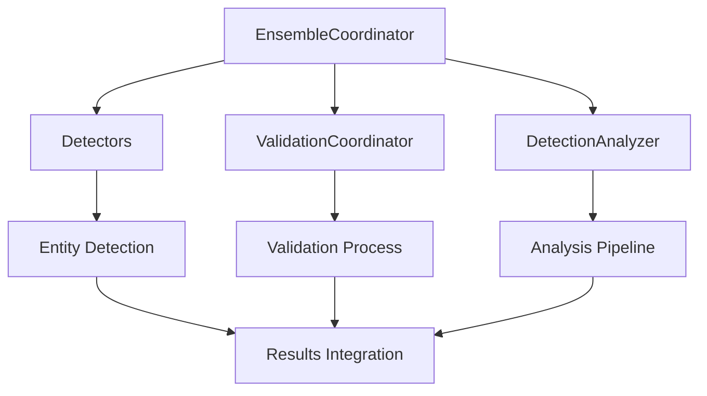

#### Data Flow
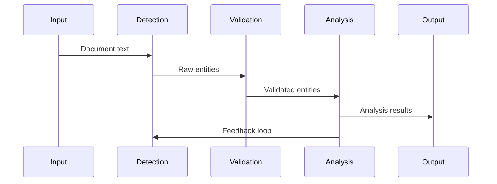

### 7. Execution and Command Interface

#### Command Line Interface
```bash
# Basic detection
python -m evaluation.evaluate detect --test <test_id> --entity <entity_type>

# Batch analysis
python -m evaluation.evaluate batch --test <test_ids> --entity <entity_type>

# Analysis mode
python -m evaluation.evaluate analyze --test <test_id> --entity <entity_type> --format detailed

# Comparison
python -m evaluation.evaluate compare --test <test_id> --compare-with <previous_run>
```

#### Analysis Options
- Detection analysis
- Validation analysis
- Pattern analysis
- Confidence analysis
- Batch analysis
- Comparative analysis
