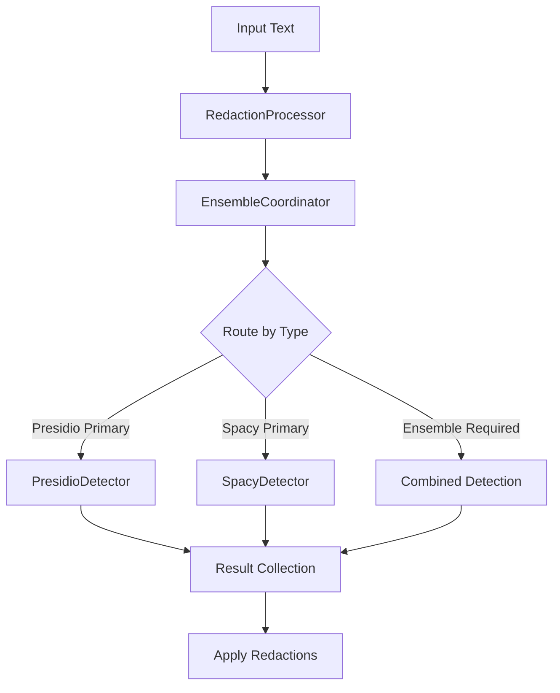

# Resume Redaction System Architecture

## Overview
The Resume Redaction System automatically detects and redacts sensitive information from resumes and professional documents while preserving important technical and professional content. The system combines Presidio's NLP capabilities with spaCy's contextual understanding, using a configuration-driven approach for entity detection and validation.

## System Components

### 1. Core Detection Framework

#### BaseDetector Interface
Base interface defining core detection and validation capabilities:
- Common configuration validation logic
- Shared text preparation utilities
- Entity type validation rules
- Confidence threshold management
Each detector implements these core methods while adding specialized detection capabilities.

#### PresidioDetector
Primary detector for pattern-based entities:
- Direct validation using validation_params.json rules
- Enhanced NLP recognition for structured data
- Confidence scoring based on pattern matches and context
- Specialized handling of addresses, emails, and structured identifiers
- Strong validation rules for formatted data types

#### SpacyDetector
Context-aware named entity recognition:
- Specialized in unstructured text analysis
- Strong performance on person names and organizations
- Contextual understanding for professional terms
- Geographic and location entity detection
- Enhanced validation for natural language entities

#### EnsembleCoordinator
Orchestrates multiple detection systems:
- Routes entities based on entity_routing.yaml configuration
- Combines results using weighted confidence scores
- Manages detector-specific validation rules
- Resolves conflicts between detectors
- Handles confidence thresholds at both detector and ensemble levels
- Post-processes results to remove overlaps and duplicates

### 2. Configuration System

#### Core Configuration Files
The system uses two primary configuration files:

**validation_params.json**
- Single source of truth for entity validation
- Defines validation rules per entity type
- Sets confidence adjustments and thresholds
- Specifies context requirements
- Provides pattern definitions where needed

**entity_routing.yaml**
```yaml
routing:
  presidio_primary:
    entities:
      - ADDRESS
      - EMAIL_ADDRESS
      - PHONE_NUMBER
      - INTERNET_REFERENCE
      - LOCATION
      - GPA
      - EDUCATIONAL_INSTITUTION
    thresholds:
      ADDRESS: 0.8
      EMAIL_ADDRESS: 0.7
      PHONE_NUMBER: 0.8

  spacy_primary:
    entities:
      - PERSON
    thresholds:
      PERSON: 0.6

  ensemble_required:
    entities:
      - DATE_TIME
      - EDUCATIONAL_INSTITUTION
      - PHI
      - PROTECTED_CLASS
    confidence_thresholds:
      DATE_TIME:
        minimum_combined: 0.7
        presidio_weight: 0.65
        spacy_weight: 0.35
```

#### Configuration Management
ConfigLoader class provides:
- Centralized configuration loading
- Environment-specific settings
- Path resolution for config files
- Config validation and error handling

### 3. Processing Pipeline

#### Core Processing Components

**RedactionProcessor**
- Main orchestration component
- Manages entity detection workflow
- Handles text normalization and filtering
- Integrates with ensemble detection system
- Applies redaction rules and filtering

**RedactFileProcessor**
- Handles PDF file operations
- Manages bounding boxes for redactions
- Applies redaction styling
- PDF validation and error handling

#### Detection Flow


#### Process Stages

1. **Input Processing**
   - Document text extraction
   - Initial text normalization
   - Word list generation for PDF mapping

2. **Entity Detection**
   - Primary detection based on entity routing rules
   - Direct validation using validation_params.json rules
   - Entity validation and confidence scoring
   - Ensemble detection for complex entities

3. **Result Processing**
   - Combine detection results
   - Apply keep_word filters
   - Generate bounding boxes for redaction
   - Resolve overlaps and conflicts

4. **Output Generation**
   - Apply redactions to PDF
   - Generate redaction statistics
   - Handle output file creation

### 4. Evaluation and Testing Framework

#### Evaluation Components

**EvaluationGUI**
- Interactive testing interface
- Entity-type specific analysis
- Performance metrics visualization
- Debug logging display
- Configuration testing and validation

**TestRunner**
- Batch test execution
- Statistical analysis
- Performance metrics collection
- Comparison between runs
- Validation rule effectiveness testing

#### Testing Infrastructure

**StageOneEvaluator**
- Entity detection analysis
- Validation rule testing
- Confidence score evaluation
- Detection overlap analysis
- Entity type coverage testing

**EntityMatcher**
- Ground truth comparison
- Entity span matching
- Confidence threshold testing
- False positive/negative analysis
- Context validation testing

**EntityMetrics**
- Precision/recall calculation
- Type-based performance metrics
- Confidence distribution analysis
- Validation rule effectiveness measurement
- Detection source analysis

#### Test Suite Organization
```
data/
  test_suite/
    originals/       # Original test documents
    annotations/     # Ground truth annotations
    results/        # Test run results
    test_manifest.yaml  # Test definitions
```

#### Evaluation Metrics
Key metrics tracked by the system:
- Entity detection accuracy by type
- Validation rule effectiveness
- Detector performance comparison
- Context validation success rate
- Processing performance
- Memory usage
- Configuration coverage
- False positive/negative rates
