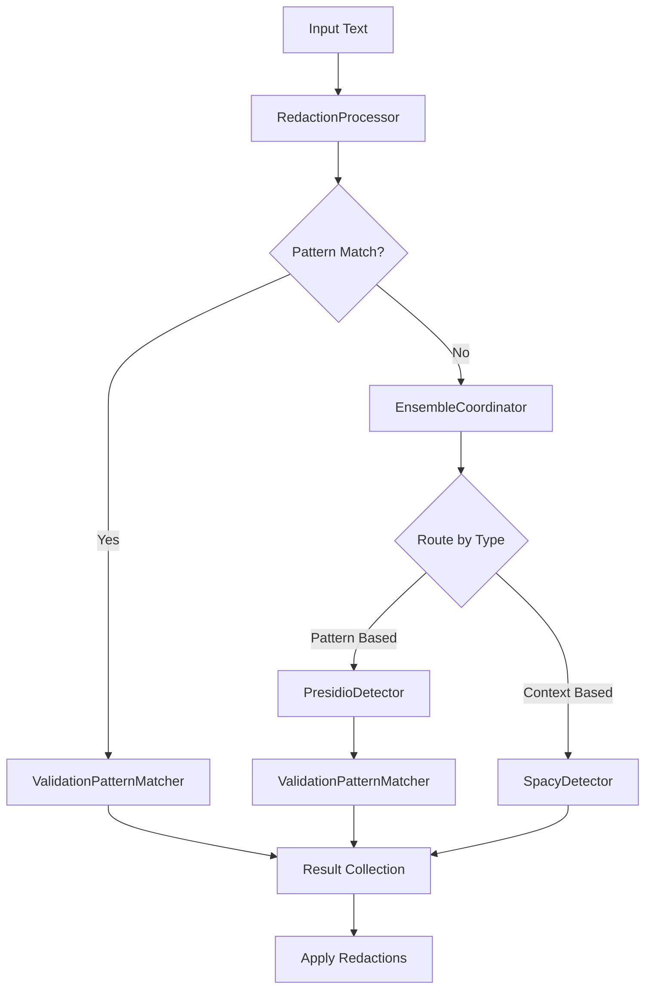

# Resume Redaction System Architecture

## Overview
The Resume Redaction System automatically detects and redacts sensitive information from resumes and professional documents while preserving important technical and professional content. The system uses a consolidated approach with a single source of truth for pattern matching, combining Presidio's NLP capabilities with spaCy's contextual understanding.

## System Components

### 1. Core Detection Framework
The system uses a modular entity detection framework with the following key components:

#### BaseDetector Interface
Common interface defining core detection capabilities:
```python
class BaseDetector:
    """Base interface for entity detection implementations"""
    def detect_entities(self, text: str) -> List[Entity]
    def validate_detection(self, entity: Entity) -> bool
    def get_confidence(self, entity: Entity) -> float
    def prepare_text(self, text: str) -> str
```

#### ValidationPatternMatcher
Central pattern matching component that serves as single source of truth:
- Loads patterns from validation_params.json
- Provides consistent validation rules
- Used by both direct pattern matching and Presidio
- Sections:
  * Pattern Loading and Management
  * Entity Detection
  * Preprocessing and Filtering
  * Validation Logic

#### Specialized Detectors

**PresidioDetector**
- Primary responsibility: NLP-enhanced pattern detection
- Uses ValidationPatternMatcher for consistent pattern handling
- Sections:
  * Configuration and Setup
  * Entity Detection
  * Result Processing
  * Entity Validation

**SpacyDetector**
- Primary responsibility: Context-aware named entity recognition
- Strengths:
  * Person names and titles
  * Organization names
  * Geographic locations
  * Professional context understanding

#### EnsembleCoordinator
Coordinates detection systems:
- Routes entities based on configured rules
- Combines results using weighted confidence scores
- Resolves detection conflicts
- Applies validation through ValidationPatternMatcher

### 2. Configuration System

#### Core Configuration Files
The system uses a set of JSON and YAML configuration files:

**validation_params.json**
- Primary source of truth for pattern matching
- Entity-specific validation rules
- Confidence thresholds and adjustments
- Context requirements for each entity type

**entity_routing.yaml**
```yaml
routing:
  presidio_primary:
    entities:
      - ADDRESS
      - EMAIL_ADDRESS
      - PHONE_NUMBER
      - INTERNET_REFERENCE
      - LOCATION
      - GPA
      - EDUCATIONAL_INSTITUTION
    thresholds:
      ADDRESS: 0.8
      EMAIL_ADDRESS: 0.7
      PHONE_NUMBER: 0.8
      # ... other thresholds

  spacy_primary:
    entities:
      - PERSON
    thresholds:
      PERSON: 0.6

  ensemble_required:
    entities:
      - DATE_TIME
      - EDUCATIONAL_INSTITUTION
      - PHI
      - PROTECTED_CLASS
    confidence_thresholds:
      DATE_TIME:
        minimum_combined: 0.7
        presidio_weight: 0.65
        spacy_weight: 0.35
      # ... other entity settings
```

#### Configuration Management
ConfigLoader class provides:
- Centralized configuration loading
- Environment-specific settings
- Path resolution for config files
- Config validation and error handling

### 3. Processing Pipeline

#### Core Processing Components
1. **RedactionProcessor**
   - Main orchestration component
   - Uses ValidationPatternMatcher for pattern detection
   - Integrates with EnsembleCoordinator
   - Handles text normalization and filtering

2. **RedactFileProcessor**
   - Handles PDF file operations
   - Manages bounding boxes for redactions
   - Applies redaction styling
   - PDF validation and error handling

#### Detection Flow


#### Process Stages

1. **Input Processing**
   - Document text extraction
   - Initial text normalization
   - Word list generation for PDF mapping

2. **Entity Detection**
   - Pattern-based detection using ValidationPatternMatcher
   - Fallback to ensemble detection if needed
   - Entity validation and confidence scoring

3. **Result Processing**
   - Combine detection results
   - Apply keep_word filters
   - Generate bounding boxes for redaction

4. **Output Generation**
   - Apply redactions to PDF
   - Generate redaction statistics
   - Handle output file creation
  
### 4. Evaluation and Testing Framework

#### Evaluation Components

1. **EvaluationGUI**
   - Interactive testing interface
   - Entity-type specific analysis
   - Performance metrics visualization
   - Debug logging display

2. **TestRunner**
   - Batch test execution
   - Statistical analysis
   - Performance metrics collection
   - Comparison between runs

#### Testing Infrastructure

1. **StageOneEvaluator**
   - Entity detection analysis
   - Pattern matching validation
   - Confidence score evaluation
   - Detection overlap analysis

2. **EntityMatcher**
   - Ground truth comparison
   - Entity span matching
   - Confidence threshold testing
   - False positive/negative analysis

3. **EntityMetrics**
   - Precision/recall calculation
   - Type-based performance metrics
   - Confidence distribution analysis
   - Pattern effectiveness measurement

#### Test Suite Organization
```
data/
  test_suite/
    originals/       # Original test documents
    annotations/     # Ground truth annotations
    results/        # Test run results
    test_manifest.yaml  # Test definitions
```

#### Evaluation Metrics
- Entity detection accuracy
- Pattern matching precision
- Context validation effectiveness
- Processing performance
- Memory usage tracking
