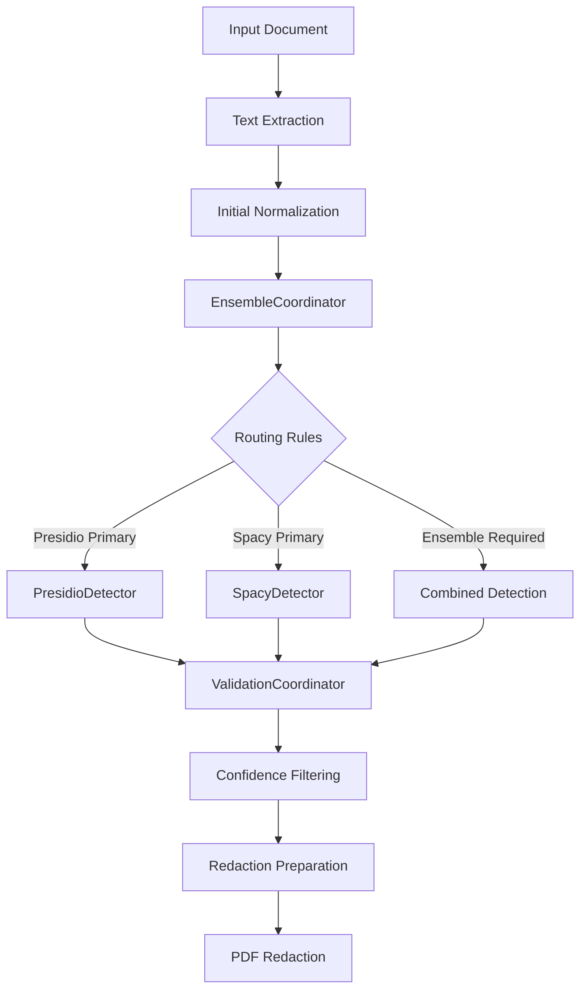

# Resume Redaction System Architecture

## Overview
The Resume Redaction System automatically detects and redacts sensitive information from resumes and professional documents while preserving important technical and professional content. The system leverages a sophisticated, configuration-driven approach to entity detection and validation, combining advanced natural language processing techniques with flexible validation rules.

## System Design Principles
- **Modular Architecture**: Easily extensible detection and validation components
- **Configuration-Driven**: Validation and detection rules defined through JSON and YAML configurations
- **Multi-Model Approach**: Combines multiple NLP models for comprehensive entity detection
- **Contextual Intelligence**: Advanced context-aware validation of detected entities
- **Configurable Confidence Scoring**: Flexible threshold and confidence management
- **Privacy-Preserving**: Robust redaction of sensitive personal information

## System Components

### 1. Core Detection Framework

#### Validation Architecture
The system introduces a centralized `ValidationCoordinator` that revolutionizes entity validation:
- Unifies validation logic across different detection systems
- Provides a single, configuration-driven validation approach
- Decouples validation rules from specific detectors
- Enables complex, multi-stage validation for sensitive entities
- Supports granular confidence adjustments based on contextual analysis

#### Core Detection Interfaces

##### BaseDetector
Abstract base class defining core detection capabilities:
- Shared configuration and logging mechanisms
- Basic text preparation utilities
- Foundational entity detection interface
- Debug and logging support
- Confidence threshold management

##### Specialized Detectors
1. **PresidioDetector**
   - Pattern-based entity recognition
   - Strong performance with structured data
   - Specialized in detecting formatted identifiers
   - Handles addresses, emails, and structured personal information

2. **SpacyDetector**
   - Context-aware named entity recognition
   - Advanced linguistic analysis
   - Strong performance with unstructured text
   - Specializes in person names, organizations, and contextual entities

#### EnsembleCoordinator
Central orchestration component for entity detection:
- Manages multiple detection systems
- Routes entities based on configuration
- Combines results using weighted confidence scores
- Resolves conflicts between different detectors
- Applies post-processing to remove overlapping entities

### 2. Configuration Management System

#### Configuration Files

##### validation_params.json
The central configuration for entity validation:
- Defines comprehensive validation rules per entity type
- Specifies confidence adjustment mechanisms
- Provides detailed context requirements
- Includes pattern definitions for complex validations
- Supports fine-grained validation logic for sensitive entities

Key Configuration Sections:
- Validation rules for each entity type
- Confidence boost and penalty mechanisms
- Context word and pattern definitions
- Specialized validation requirements
- Entity-specific detection strategies

##### entity_routing.yaml
Defines detection and routing strategies:
```yaml
routing:
  presidio_primary:
    entities:
      - ADDRESS
      - EMAIL_ADDRESS
      - PHONE_NUMBER
      - INTERNET_REFERENCE
      - LOCATION
      - GPA
      - EDUCATIONAL_INSTITUTION
    thresholds:
      ADDRESS: 0.8
      EMAIL_ADDRESS: 0.7
      PHONE_NUMBER: 0.8

  spacy_primary:
    entities:
      - PERSON
    thresholds:
      PERSON: 0.6

  ensemble_required:
    entities:
      - DATE_TIME
      - EDUCATIONAL_INSTITUTION
      - PHI
      - PROTECTED_CLASS
    confidence_thresholds:
      DATE_TIME:
        minimum_combined: 0.7
        presidio_weight: 0.65
        spacy_weight: 0.35
```

#### ConfigLoader
Centralized configuration management:
- Dynamic configuration loading
- Environment-specific settings
- Validation of configuration files
- Error handling and logging
- Path resolution for configuration resources

### 3. Validation Framework

#### ValidationCoordinator
Core validation orchestration component:
- Centralizes validation logic for all entity types
- Implements configuration-driven validation strategies
- Provides unified validation interface
- Manages complex validation workflows
- Supports multi-stage validation processes

#### Validation Methods
The system uses a comprehensive, modular approach to entity validation:
- Dedicated validation methods for each entity type
- Configuration-driven validation rules
- Flexible confidence adjustment mechanisms
- Detailed reasoning and context analysis

Validation Process:
1. Receive detected entities from detectors
2. Identify the appropriate validation method
3. Apply type-specific validation rules
4. Analyze contextual information
5. Dynamically adjust confidence scores
6. Determine entity validity
7. Provide detailed validation results with reasoning

#### Entity Validation Methods
Specialized validation methods for various entity types:
- Educational Institution
- Person
- Location
- Address
- Email Address
- Phone Number
- GPA
- Internet Reference
- Protected Class
- Protected Health Information (PHI)

Each validation method:
- Checks basic format and requirements
- Validates against configuration rules
- Applies contextual analysis
- Adjusts confidence dynamically
- Provides detailed validation reasoning

#### Validation Strategies
- **Rule-Based Validation**: Configuration-defined rules
- **Contextual Analysis**: Deep linguistic and contextual examination
- **Confidence Scoring**: Dynamic confidence adjustment
- **Multi-Model Validation**: Cross-validation across detection systems

### 4. Processing Pipeline

#### Entity Detection Workflow


#### Processing Stages
1. **Input Processing**
   - Document text extraction
   - Initial text normalization
   - Prepare for entity detection

2. **Entity Detection**
   - Apply routing rules
   - Detect entities using multiple models
   - Validate detected entities
   - Apply confidence thresholds

3. **Redaction Preparation**
   - Generate redaction bounding boxes
   - Apply keep-word filters
   - Resolve entity conflicts

4. **Redaction Application**
   - Apply redactions to the document
   - Generate processing report
   - Preserve document structure

### 5. Evaluation and Testing Framework

#### Evaluation Components

##### Performance Metrics Tracking
Key metrics for system assessment:
- Entity detection accuracy by type
- Validation rule effectiveness
- Detector performance comparison
- Context validation success rate
- Processing performance
- Memory usage
- Configuration coverage
- False positive/negative rates

##### TestRunner
Comprehensive testing infrastructure:
- Batch test execution
- Statistical analysis
- Performance metrics collection
- Comparative testing between system versions
- Validation rule effectiveness assessment

#### Test Suite Organization
```
data/
  test_suite/
    originals/       # Original test documents
    annotations/     # Ground truth annotations
    results/         # Test run results
    test_manifest.yaml  # Test definitions
```

#### Evaluation Strategies

##### EntityMatcher
Advanced entity validation system:
- Ground truth comparison
- Precise entity span matching
- Confidence threshold testing
- False positive/negative analysis
- Contextual validation verification

##### StageOneEvaluator
Comprehensive detection analysis:
- Detailed entity detection assessment
- Validation rule verification
- Confidence score evaluation
- Detection overlap identification
- Entity type coverage testing

##### EntityMetrics
Advanced performance analytics:
- Precision and recall calculation
- Granular performance metrics by entity type
- Confidence distribution analysis
- Validation rule effectiveness measurement
- Detection source performance tracking

### 6. Security and Privacy Considerations

#### Privacy Protection Mechanisms
- Strict entity validation rules
- Configurable redaction strategies
- Minimal information retention
- Comprehensive sensitive data identification
- Adaptive detection across document types

#### Compliance Features
- GDPR and CCPA alignment
- Configurable redaction levels
- Audit trail generation
- Anonymization support
- Minimal data exposure

### 7. Advanced Features and Extensibility

#### Customization Points
- Pluggable detection models
- Configurable validation rules
- Custom entity type support
- Extensible configuration system
- Modular architecture for easy enhancement

#### Future Development Roadmap
- Machine learning-based validation improvements
- Enhanced contextual understanding
- Support for additional document types
- Multilingual detection capabilities
- Advanced anonymization techniques

### 8. Performance Optimization

#### Optimization Strategies
- Efficient memory management
- Parallel processing support
- Caching mechanisms
- Lazy loading of detection models
- Configurable performance thresholds

#### Scalability Considerations
- Horizontal scaling support
- Cloud-native architecture
- Containerization readiness
- Microservices compatibility
- Dynamic resource allocation

### Conclusion
The Resume Redaction System represents a sophisticated, flexible approach to sensitive information detection and redaction. The system provides robust, adaptable privacy protection across various document types by combining advanced NLP techniques, configuration-driven validation, and comprehensive testing strategies.
